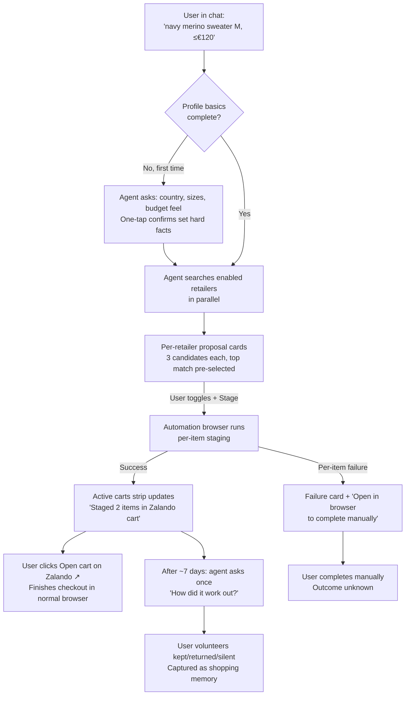
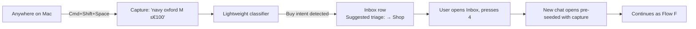

## Bestfriend — Shopping Assistant module

Companion to `personal-agent-plan.md`, `personal-agent-design.md`, and `personal-agent-stories.md`. This file describes the **business logic and product behavior** of the Shopping module. Engineering specifics (schema, tool schemas, IPC, file paths, UI measurements) live in those other docs.

---

## What this is, in one sentence

Bestfriend can shop online for clothes for you: you describe what you want, it finds candidates across a small set of retailers you trust, and **stages them in your cart on the retailer's site for you to check out yourself.**

Bestfriend never holds your card, never logs in for you, never completes a checkout, and never bypasses anti-bot protections. You stay in control of the moment money moves.

---

## Anchor

> **One-shot fulfillment for clothes** — "Tell Bestfriend what you want; it stages candidates in your retailer cart for you to check out."

This is the *one* thing the Shopping module is built to nail in v1. Onboarding is **lazy** — there is no new onboarding step. The first shopping chat asks for the basics inline (country, sizes, rough budget feel) and proceeds. The project-brain anchor stays the day-1 user experience; shopping arrives as a meaningful new module on top of a solid base.

---

## Who it's for

The audience-of-one persona from `personal-agent-stories.md` adds one trait for this module:
- shops online for clothes a few times a month at the usual EU retailers and would rather describe what they want once than tab through five sites.

---

## The 12 locked product decisions

| # | Question | Lock |
|---|---|---|
| Q1 | Anchor job | One-shot fulfillment ("describe → agent stages") |
| Q2 | v1 primary mode | Intent-driven requests over wardrobe-discovery feed |
| Q3 | Autonomy level | **Cart-staging only** — agent stages, user checks out |
| Q4 | Retailer strategy | Recipe-based browser automation against a small allowlist |
| Q5a | Categories in v1 | **Clothes only** |
| Q5b | Geography | **Latvia / EU shipping** |
| Q5c | Retailer allowlist | **Zalando.lv, About You, Asos, H&M.lv, Asket** |
| Q6 | Where shopping happens | Chat primary + Inbox `Shop` triage; no dedicated section; no proactive watchers |
| Q7 | What Bestfriend remembers | Hard constraints structured (sizes, country, budget anchors); soft taste in memories |
| Q8 | What the user sees + accepts | 3 candidates per retailer, per-retailer cards, on-accept staging, agent clarifies before proposing if request is vague |
| Q9 | When things go wrong | Bestfriend owns staging failures end-to-end; post-checkout (delivery / returns) is hands-off with a soft "how did it go?" follow-up |
| Q10 | Cart state visibility | A live "Active carts" strip at the top of any chat that has staged items |
| Q11 | Safety promises | Audit log, hard per-item ceiling (€500 with type-to-confirm), action caps per chat and per retailer per day, no undo (the Accept *is* the gate) |
| Q12 | Stories + MVP slice | S-Shop-1..7 + 8 milestones, with **Asket-only end-to-end** as the thinnest valuable shipping unit |

---

## v1 scope (locked)

- **Category**: clothes only. Groceries, electronics, home goods, etc. are Phase 2 — same business logic, new retailer relationships.
- **Region**: Latvia. EU shipping. EUR. Sizes captured in EU notation.
- **Retailers**: five, fixed at launch:
  - **Zalando.lv** — biggest catalog, mid-range price band, localized to LV.
  - **About You** — Hamburg-based, dominant in the Baltics, multi-brand cart/checkout.
  - **Asos** — broad EU catalog, strong style range.
  - **H&M.lv** — price floor; almost everyone has an account already.
  - **Asket** — clean basics, very stable site, the "easy" retailer to launch with.
- Retailers explicitly **not** in v1: Amazon (its terms prohibit automation), fast-fashion marketplaces like Shein and Temu (low taste-match value, brand-safety concerns).
- **Autonomy**: cart-staging only. Bestfriend never holds payment, never enters credentials, never solves CAPTCHAs, never completes a checkout.

The retailer slate is per-user and configurable; the five above are the *defaults* we preload for a Latvia-based user.

---

## The autonomy promise

This is the most important sentence in this whole doc:

> **Bestfriend's responsibility ends at "successfully staged in your cart on the retailer's site." Everything that happens after — checkout, payment, delivery, returns — is yours to do, on the retailer's site, with your own browser.**

This means:
- Bestfriend never sees your card, never stores payment details, never has to be PCI-aware.
- Bestfriend never types your password into a retailer.
- A wrong proposal can never accidentally cost you money — the worst case is a few items in your cart that you don't accept, which you remove on the retailer's cart page.
- The trust contract is small enough to actually be trustable.

If you want autonomy beyond this in the future (auto-buy under a threshold, agent completes checkout for repeat orders, etc.), that's a deliberate Phase 3+ conversation that reopens the autonomy lock.

---

## User stories

### S-Shop-1 — Describe an item, get candidates staged in cart
- I open a chat and type "find me a navy merino sweater, M, ≤€120, ships to LV."
- Agent confirms missing context if any (occasion? brand? specific fit?), then searches enabled retailers in parallel.
- Per-retailer **shopping proposal cards** arrive — up to 3 candidates each, with reasoning, image, size, color, price, ETA, return policy.
- I toggle which to stage, hit `Stage selected → Zalando cart`.
- The visible automation browser runs the staging; the **Active carts strip** at the top of the chat updates.
- I click `Open cart on Zalando ↗`, finish checkout in my normal browser. Bestfriend never sees payment.

### S-Shop-2 — Quick-capture a buying intent
- `⌘⇧Space` → "navy oxford M ≤€100."
- Lands in Inbox; the triage classifier suggests `→ Shop`.
- Later I open Inbox, press `4`. A chat opens pre-seeded with the capture text.
- Standard S-Shop-1 flow from there.

### S-Shop-3 — First-time bootstrap (no upfront form)
- First shopping chat triggers the lazy bootstrap.
- Agent: "Quick basics — country, top size, shoe size EU, rough budget feel?"
- I answer conversationally; the agent confirms each hard fact with a one-tap confirmation card the first time it sets a field.
- Search proceeds. Future shopping chats skip this; missing fields are asked only when relevant ("what's your dress size?" only on a first dress request).

### S-Shop-4 — Graceful retailer failure
- An Asos staging attempt hits a Cloudflare check.
- The proposal card is replaced with a **failure card** explaining what happened in plain English.
- The visible automation browser foregrounds on Asos's cart page so I can finish staging by hand.
- A note appears in the Feed: "Staging failed at Asos — anti-bot challenge."
- After three such failures in 24 hours, Asos drops to **discovery-only mode** in subsequent proposals: it still finds items, but says "Open in Asos to add manually" instead of `Stage`. This re-arms automatically after 24 hours.

### S-Shop-5 — Visibility into what was done
- **Settings → Privacy → Shopping activity** shows every action Bestfriend has performed on my retailer accounts: searches, page reads, cart adds, cart peeks. With timestamps, statuses, and an optional debug screenshot when something failed.
- **Settings → Shopping → Connected retailers** shows per-retailer status (Connected / Not connected / Expired / Discovery-only) and a `Disconnect` button per retailer.
- **Wipe all data** also wipes everything shopping-related: profile, staged carts, recipe activity, retailer sessions, shopping memories, shopping conversation context.
- **Clear shopping memories** is available as a scoped wipe to reset taste without nuking everything else.

### S-Shop-6 — Taste learns from outcomes (without forms)
- A few days after staging, on a future turn in the same shopping conversation, the agent asks once (and only once): "How did the Asket crewneck work out?"
- I say "returned it — too thin." Agent captures a shopping memory ("avoid lightweight merino"). The outcome resolves; I'm never asked about that item again.
- Next sweater request quietly de-prioritizes lightweight knits.

### S-Shop-7 — Automation browser feels intentional, not creepy
- During a staging run, Bestfriend's automation browser foregrounds with a distinct window title (e.g. `Bestfriend · Zalando`) so I never confuse it with my main browser.
- It quietly returns to the background when the run completes — or stays in front for me to take over if something needs my attention.
- Each retailer has its own isolated browser profile; sessions never cross-contaminate.

---

## End-to-end user flows

### Flow F — One-shot clothes shopping (S-Shop-1)

### Flow G — Shopping intent via Inbox (S-Shop-2)

---

## Where shopping lives in the app

The Shopping module reuses the existing app surfaces. **There is no new top-level Shopping section in v1.**

- **Chat (primary entry).** Shopping is just a regular chat where the agent happens to call shopping tools. The proposal-card pattern from the rest of Bestfriend extends naturally — same trust contract, same accept/reject feel.
- **Inbox (secondary entry).** The four existing triage actions (Reminder / Note / Chat / Dismiss) gain a fifth: **Shop**. When a quick-capture looks like a buying intent ("buy X", "I need Y"), the classifier suggests it. Accepting the triage opens a chat pre-seeded with the capture.
- **Active carts strip (in-chat).** Any chat that has staged items shows a slim sticky strip at the top with one row per retailer: item count, last-staged time, and an `Open cart ↗` button that takes you to the retailer's checkout in your normal browser.
- **Feed.** New item types: "Staged at [Retailer]", "Staging failed at [Retailer]", "[Retailer] in discovery-only mode."
- **Settings.** A new `Shopping` pane (profile, sizes, budget anchors, exclusions, connected retailers). A `Privacy → Shopping activity` pane for the full audit log.

What's deliberately **not** in v1:
- A dedicated "Shopping" sidebar destination.
- A wardrobe-discovery / for-you feed.
- Proactive purchase suggestions (price watches, auto-restock, calendar-driven outfit picks).

---

## What Bestfriend remembers about you

Two layers, by intent:

**Hard constraints** — kept structured because getting them wrong destroys trust on the first interaction:
- Country and currency.
- Shipping label (display-only — Bestfriend never autofills it at the retailer; it shows it back to you in proposal cards as a sanity check).
- **Sizes** per garment class (top, bottom, outerwear, dress, shirt collar, shoe in EU notation).
- Budget anchors per garment class (advisory — flag candidates as "above your usual" but never block).
- Hard exclusions ("wool", "leather", logo restrictions).
- Per-item price ceiling (default €500; type-to-confirm above).
- Which retailers are enabled.

**Soft taste** — accumulated as memories, the same way Bestfriend already remembers facts about you for the rest of the app:
- "Prefers natural fibers"
- "Owns mostly navy/grey/black"
- "Doesn't wear graphic tees"
- "Likes Norse Projects, dislikes Diesel"
- Outcomes from past purchases ("returned the navy merino — too thin")

Hard facts are confirmed by you the first time the agent sets a field, and editable in Settings → Shopping. Soft taste lives in Settings → Memories with a "Shopping" filter you can scroll, edit, pin, or wipe.

**Bootstrap timing**: there is no new onboarding step. The first shopping chat asks for the relevant basics inline; future shopping chats skip whatever's already on file and ask only when something new is needed (e.g. shoe size only when you first ask for shoes).

---

## What you see and accept (the proposal card)

This is the customer-visible trust contract.

- **Per-retailer cards**, one per retailer that has candidates. Cards stack in score order (best retailer first). Empty retailers are silently dropped.
- **3 candidates per card**, with the top match pre-selected. You toggle which to stage. Each candidate shows: image, brand, title, size, color, price, a one-line reasoning ("matches navy, merino, M; under your €120 cap"), and an `Open product ↗` link to view the retailer's product page directly.
- **Card header** shows retailer + a live total of currently-selected candidates. **Footer** shows ETA + return policy summary.
- **Staging happens on Accept** — not while the proposal is being assembled. Nothing touches your cart until you explicitly click `Stage selected → [Retailer] cart`.
- **Above the per-item ceiling** (default €500), the card requires you to type the literal word `stage` in chat to confirm — not just click. This protects against runaway proposals on a typo or a bad day for the model.
- **After Accept**, the card transforms into a result card: ✓ "Staged 2 items in Zalando cart", with `Open cart on Zalando ↗` to take you to the retailer's checkout in your normal browser.
- **If the request is underspecified** ("I need new shoes"), the agent asks clarifying questions in chat first — it won't propose anything until it knows enough about the garment class, your size, and your rough price ceiling.
- **If confidence is low**, the agent says so in plain text rather than emitting a proposal card.

---

## When things go wrong

### Staging fails (Bestfriend's job to handle)
- The proposal card is replaced by a **failure card** explaining what happened: "Staging blocked by Asos — anti-bot challenge", "Item out of stock", "Login expired", "Site error", etc.
- The visible automation browser foregrounds on the relevant page so you can finish manually if you want.
- A Feed item records the failure.
- A retailer that fails three times in 24 hours drops to **discovery-only mode**: it still finds items, but offers `Open in [retailer] to add manually` instead of staging. This re-arms after 24 hours or after a successful manual recipe test.

### Anti-bot challenges (CAPTCHAs etc.)
- Bestfriend never tries to solve them. They surface to you in the visible browser; the chat shows "Waiting for you to confirm in [Retailer] window…"; the run resumes when you dismiss the challenge or return focus.

### Post-delivery issues (returns, defects, lost packages)
- Hands-off. Bestfriend doesn't track shipments, doesn't read your email for receipts, doesn't help with return forms, doesn't remind you about return windows.
- The one piece of post-delivery feedback Bestfriend collects is **a single soft "how did it go?" prompt** on a future turn in the same shopping conversation. Whatever you volunteer becomes a shopping memory ("kept it", "returned it — too thin"). You never have to answer.

### Pre-checkout regret
- If you change your mind about a staged item before checking out, you remove it on the retailer's cart page directly — Bestfriend doesn't offer an in-app un-stage in v1.

---

## Safety promises (in plain language)

- **You always click Accept before a cart is touched.** No silent staging, no pre-staging during proposal generation.
- **No card data, ever.** Bestfriend cannot store, see, or transmit payment details. Checkout happens entirely on the retailer's site, in your normal browser.
- **No password handling.** You log into each retailer once, yourself, in the visible automation browser. Bestfriend never types your password.
- **No anti-bot bypass.** When a retailer challenges the session, you handle the challenge.
- **Hard per-item ceiling.** Default €500. Above that, the proposal requires you to type the word `stage` in chat — not just click.
- **Action caps.** Max 3 candidates per retailer per proposal. Max 6 staging actions per conversation. Max 10 staging actions per retailer per 24 hours. These are runaway-protection rails.
- **Visible by default.** The automation browser foregrounds during runs so you can see what's happening. A power-user toggle is available to run headless if preferred.
- **Auditable.** Every action Bestfriend takes on a retailer account is logged and viewable in Settings → Privacy → Shopping activity.
- **Clean wipes.** Per-retailer `Disconnect` removes that retailer's session entirely. `Clear shopping memories` resets taste. `Wipe all data` removes everything shopping-related.

---

## Anti-stories (things we deliberately won't do in v1)

- "I want Bestfriend to **pay** for me / hold my card / complete checkout."
- "I want Bestfriend to **log me into** a retailer."
- "I want Bestfriend to **bypass anti-bot or solve CAPTCHAs**."
- "I want Bestfriend to **read my email** for receipts."
- "I want Bestfriend to **track shipments / handle returns / file warranty claims**."
- "I want Bestfriend to **remind me about return windows**."
- "I want Bestfriend to **proactively suggest purchases** I didn't ask for."
- "I want Bestfriend to **silently update** my sizes or shipping address."
- "I want Bestfriend to **un-stage** items I changed my mind about mid-flow." (Out of v1 — remove from cart on retailer site directly.)
- "I want Bestfriend to **shop on any random store**." (v1 ships a fixed allowlist of five retailers.)

Each of these would meaningfully expand scope (more credentials, more permissions, more autonomy, more legal exposure). They're parked, not forgotten — most are reasonable Phase 2 or Phase 3 conversations once the L1 trust contract has been proven.

---

## Risks (business-level)

- **Wrong sizes silently destroy trust.** A single wrong size on the first interaction is unrecoverable. We mitigate by keeping sizes as structured, confirmed, visibly-displayed-on-every-card data — never derived from memory.
- **Recipe brittleness.** Retailer sites change; staging breaks. We mitigate by being transparent about it (failure cards, Feed items, the audit pane), by failing gracefully into "open in browser to complete manually," and by capping each retailer's failures before backing off.
- **Anti-bot escalation.** Big retailers may flag automation traffic. We mitigate by being polite (one concurrent run per retailer, deliberate pacing, no header tricks) and by surfacing every challenge to the user instead of trying to fight it.
- **Terms-of-service gray areas.** Logged-in-as-user automation is permissible at most retailers but explicitly forbidden at a few (e.g. Amazon). We mitigate with a curated allowlist and a visible Settings note about the posture per retailer.
- **Hallucinated proposals.** The model could pick a wildly wrong item or an absurd price. We mitigate with the per-item ceiling + type-to-confirm, with action caps, with visible reasoning on every card so the user can spot bad picks before clicking.
- **Trust-by-visibility friction.** Foregrounding the automation browser can feel intrusive on a busy day. We mitigate with a distinct window title, a per-retailer profile badge so isolation is obvious, and a power-user headless toggle.
- **Session-credential sensitivity.** Bestfriend now holds retailer login cookies, which is a step up in sensitivity from API keys. We mitigate with isolated per-retailer profiles, encryption at rest, never logging session data, and clean per-retailer `Disconnect`.

---

## Milestones (capability-by-capability)

These ship after Bestfriend's core reminder scheduler is in place, and are independent of the macOS Reminders mirroring and onboarding-polish work.

- **M-A — Foundations.** All the new internal plumbing exists but doesn't do anything user-visible yet. Empty `Settings → Shopping` and `Settings → Privacy → Shopping activity` panes are visible.
- **M-B — First retailer connected (Asket).** The user can connect Asket by logging in once in a visible browser window. Bestfriend can stage one product programmatically for testing. Nothing is wired into chat yet.
- **M-C — First useful end-to-end conversation (Asket-only).** A user can have a full S-Shop-1 conversation against Asket: ask for a thing, get a proposal card with 3 candidates, accept selected items, see them in the Active carts strip, click `Open cart on Asket ↗` and finish checkout. **This is the thinnest valuable shipping unit. Everything after this layers on without rework.**
- **M-D — Personalization.** Lazy bootstrap on first shopping chat. Profile fields are confirmed and editable. Shopping memories accumulate. Settings → Shopping is populated and editable.
- **M-E — All five retailers.** Recipes for Zalando.lv, About You, Asos, H&M.lv added alongside Asket. Multi-retailer proposals work end-to-end.
- **M-F — Failures, breaker, audit.** Failure cards, Feed items for failures, per-retailer circuit breaker (3 failures / 24 hours → discovery-only), and the Settings → Privacy → Shopping activity audit pane all light up.
- **M-G — Inbox integration.** The Inbox classifier learns shopping intent. The 5th triage action `Shop` ships. Quick-captures can flow straight into a pre-seeded shopping chat.
- **M-H — Safety polish.** Per-item ceiling type-to-confirm. Action caps enforced and surfaced. Extended Wipe all data. Per-retailer Disconnect. Clear shopping memories. Polished automation-browser UX (window title, profile badge, foregrounding).

After M-H the Shopping module is feature-complete for v1. Phase 2 conversations (groceries, wardrobe-discovery feed, deeper autonomy) become viable once the trust contract has been proven in the wild.
